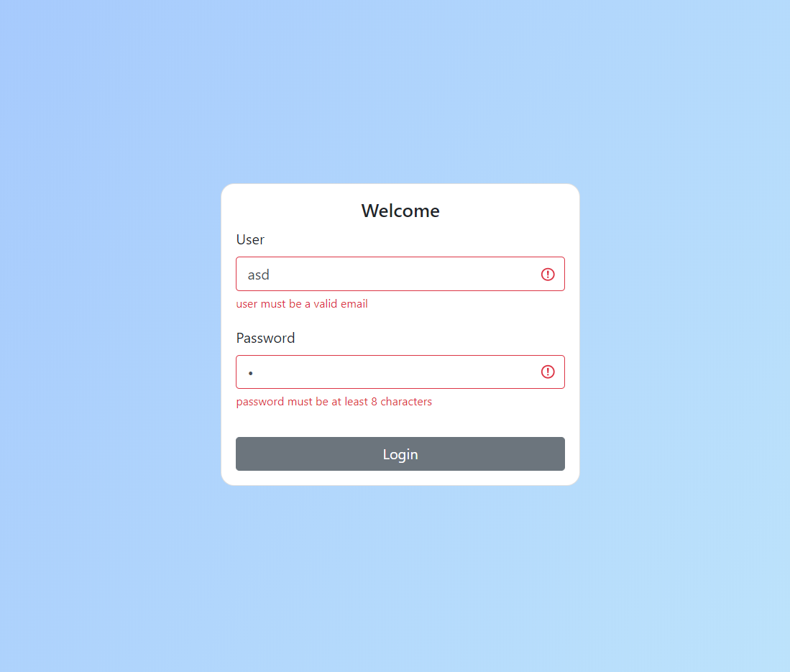

<h1>
    Resumo
</h1>

   Neste projeto exemplifico como podem ser criados formulários e validações dentro do React utilizando duas  
    bibliotecas poderosíssimas, Formilk e Yup

</h1>

    No intuito de deixar o mais simples possível resolvi utilizar apenas dois inputs, onde no primeiro são aplicadas regras 
    de validações referênte a um campo de email, e outro input são aplicadas regras de validações de senha. Tudo isso é feito  
    através de uma solução simplificada onde o Formilk é responsável por criar e estrurar o formulário e a lib Yup direciona-se 
    para cuidar das validações.

    Veja o projeto rodando no link na imagem abaixo

    

